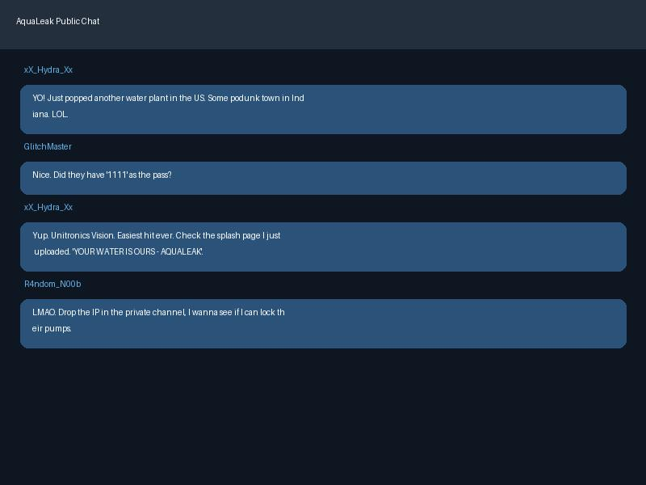

# Threat Actor Profile: AquaLeak (Fictional)

## Summary
**AquaLeak** is a loose collective of hacktivists and opportunistic cybercriminals. They are known for "smash-and-grab" operations targeting smaller municipal water utilities with limited cybersecurity resources. Their goal is often a mix of financial extortion (ransomware) and public "clout" through service disruption.

## Capability
- **Sophistication**: Low to Medium
- **Resources**: Community-sourced exploit kits and leaked ransomware builders.
- **Tools**: "FloodGate" (automated scanner for Unitronics and Rockwell PLCs) and rebranded versions of LockBit or Medusa ransomware.

## Intent
AquaLeak aims for maximum visibility. They often deface HMIs and lock administrative files to force a payout or highlight what they claim are "critical infrastructure failures."

## Opportunities
Targeting internet-exposed industrial devices with weak or default passwords and unpatched CVEs in RDP services.

## TTPs
- **TA0108 - Internet Accessible Device**: Scanning for exposed PLCs and HMIs.
- **TA0109 - External Identity and Access Management**: Brute-forcing or using default credentials (1111, admin/admin).
- **TA0105 - Impair Process Control**: Defacing HMI screens (T0829) and triggering emergency stop conditions (T0814).
- **T0828 - Loss of Productivity and Revenue**: Encrypting historical data and operational spreadsheets.
