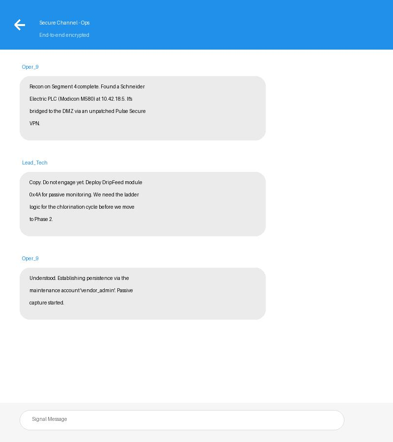

# Threat Actor Profile: HydroPhantom (Fictional)

## Summary
**HydroPhantom** is a sophisticated, state-sponsored actor specializing in the infiltration and persistent monitoring of Water and Wastewater (WWS) SCADA systems. Unlike louder actors, HydroPhantom operates with extreme stealth, focusing on custom malware and living-off-the-land techniques within the OT environment.

## Capability
- **Sophistication**: High
- **Resources**: State-level funding and technical expertise.
- **Tools**: "DripFeed" (custom modular malware for ICS reconnaissance) and "Vortex" (persistence tool targeting PLC firmware).

## Intent
HydroPhantom's primary intent is long-term prepositioning. They seek to understand the specific engineering processes of water treatment plants to enable a "kill-switch" capability that can be activated during a geopolitical conflict.

## Opportunities
HydroPhantom leverages vulnerabilities in VPN gateways and remote access software used by third-party maintenance contractors.

## TTPs (MITRE ATT&CK for ICS)
- **TA0102 - Discovery**: Using ICS-specific protocols (Modbus/S7) for passive asset discovery.
- **TA0110 - Persistence**: Modifying PLC firmware or ladder logic to maintain access without interfering with normal operations.
- **TA0103 - Lateral Movement**: Pivoting from the enterprise network to the OT DMZ via stolen engineer credentials.
- **T0859 - Valid Accounts**: Extensive use of legitimate administrative accounts to evade detection.
